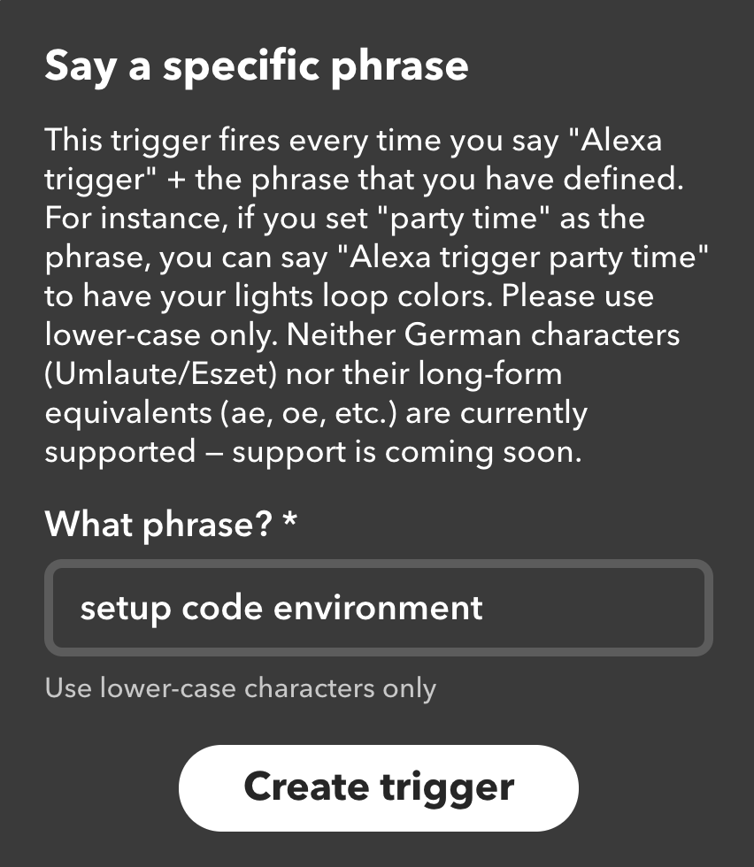
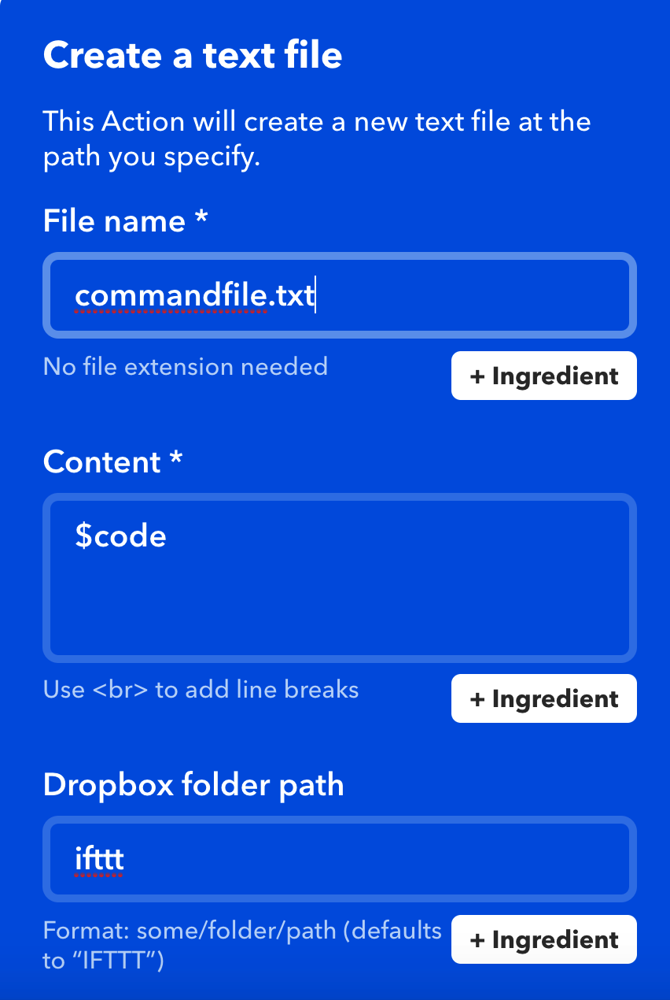
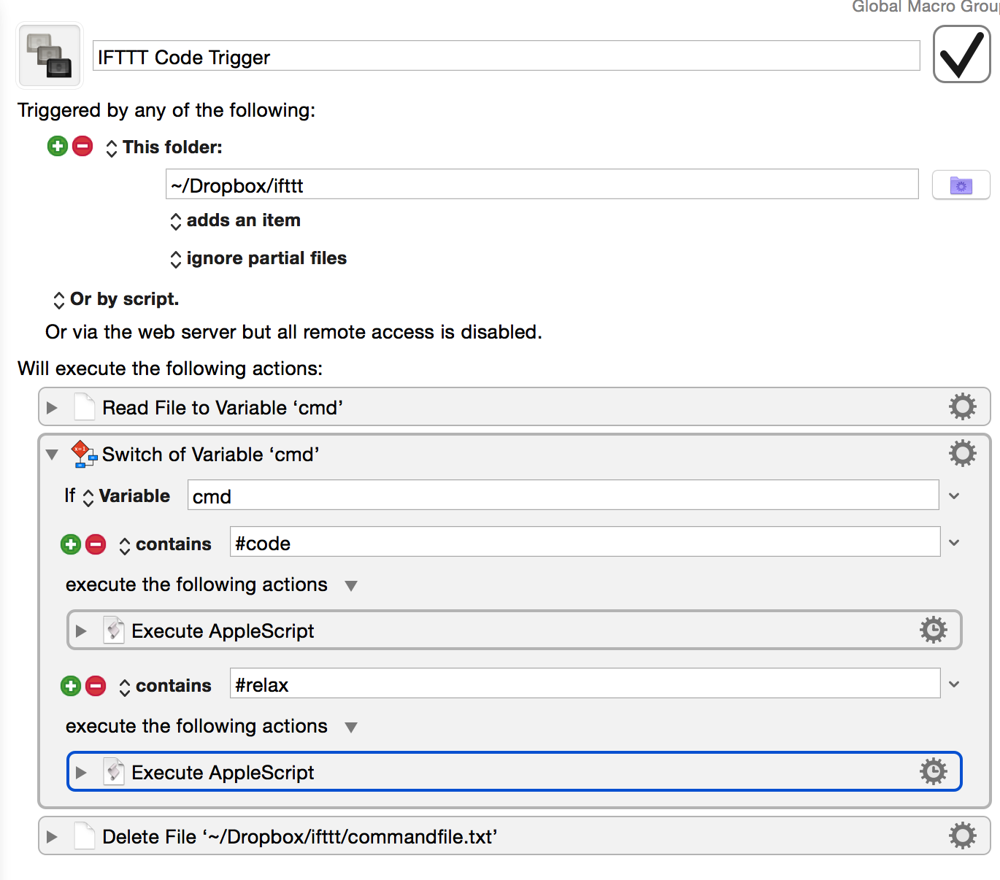

# Mac Code Workflow Setup automated with Alexa

# Description
With Alexa, IFTTT, Dropbox, Keyboard Maestro, and Applescript, I am able to create a fun chain of API commands that sets  my computer up for my preferred coding environment.
This is inspired by the tutorial I saw at
https://computers.tutsplus.com/tutorials/controlling-a-mac-from-afar-with-ifttt-and-dropbox--cms-27073
All work done for fun/learning, no credit :). 

## Tools: 
- Alexa
- IFTTT
- Dropbox
- Keyboard Maestro
- Applescript
- Winter Break

## Requirements
- Amazon Alexa product
- IFTTT Account
- Setup and Locally Connect Dropbox Account
- Download Keyboard Maestro

## Instructions
1. Create new IFTTT applet. 
2. Create an "if this" Alexa trigger

3. Create an "then that" Dropbox file action

4. Create a keyboard maestro script that handles the new dropbox script and runs the respective applescript.

## Usage
Start the trigger with the following command: "Alexa, trigger (insert ifttt trigger here)".
Alexa should respond "Sending that to IFTTT", and the rest is practically automatic. 

## Extensions:
- further extend iterm setup in applescript
- enable choice of different workflow environments (alex open python environment, alexa open ruby environment, etc)
- figure out how to make ifttt applet public (https://ifttt.com/applets/47226218d-mac-code-setup)
